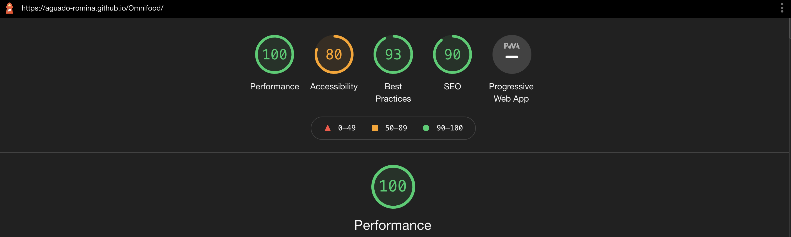

# Omnifood

## Description

Goodbye junk food. 
Hello super healthy meals.

Hello, we're Omnifood, your new premium food delivery service. We know
you're always busy. No time for cooking. So let us take care of that,
we're really good at it, we promise!

## Deployed Link

https://aguado-romina.github.io/Omnifood/

## Images

## Languages

HTML5  
CSS3  
JS  
jQuery

## Lighthouse Performance Check

## Contribute

The following is a set of guidelines for contributing. These are just guidelines, not rules, so use your best judgement and feel free to propose changes to this document in a pull request.

Issue: Ensure the bug was not already reported by searching on GitHub under issues. If you're unable to find an open issue addressing the bug, open a new issue. Write detailed information: For example:

How to reproduce the issue, step-by-step. The expected behavior (or what is wrong). Screenshots for GUI issues. The application version. The operating system.

Pull Requests: Pull Requests are always welcome.

When you edit the code, please run npm run test to check the formatting of your code before you git commit. Ensure the PR description clearly describes the problem and solution. It should include: The operating system on which you tested. The relevant issue number, if applicable.

## License

MIT

Copyright (c) 2021 Romina Aguado
